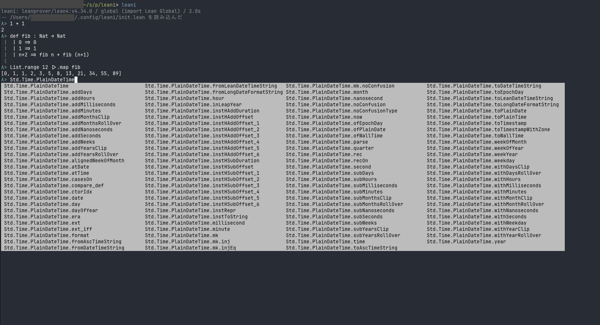

<div align="center">

# leani

**Lean 4 のための、気持ちよく書ける REPL**


[インストール](#インストール) · [使い方](docs/usage.md) · [設定](docs/config.md) · [Jupyter](docs/jupyter.md)



</div>

ファイルを作って `lake env lean` を実行しなくても、式の値や宣言の結果をその場で確かめられる。
エンジンには [leanprover-community/repl](https://github.com/leanprover-community/repl) を使う。

```
λ> 1 + 1
2
λ> def fib : Nat → Nat
 |   | 0 => 0
 |   | 1 => 1
 |   | n+2 => fib n + fib (n+1)
 |
λ> List.range 12 |>.map fib
[0, 1, 1, 2, 3, 5, 8, 13, 21, 34, 55, 89]
λ> Std.Time.PlainDateT<Tab>    → Std.Time.PlainDateTime に補完される
```

## 特徴

- **式はそのまま評価**。式は `#eval` で、宣言はそのまま実行する。複数行の入力は Lean のパーサで判定する
- **定数名の補完と略記**。Tab で定数名を補完し、`\to` は space で `→` になる
- **証明モード**。`sorry` の箇所で `:prove` を実行すると、タクティクを 1 つずつ試せる
- **Lake プロジェクトと Mathlib**。プロジェクトの中で起動すると、その `lean_lib` を import する
- **Jupyter**。カーネルとしても使える

## インストール

[elan](https://lean-lang.org/install)、git、[uv](https://docs.astral.sh/uv/getting-started/installation/) を入れてから、次を実行する。

```sh
uv tool install git+https://github.com/watanany/leani
```

`leani` コマンドが見つからなければ、`uv tool update-shell` を実行する。

## はじめる

```sh
leani                  # elan のデフォルトの Lean で起動する
leani --setup          # エンジンのビルドだけを先に済ませる
```

初回は Lean のバージョンごとにエンジンを GitHub から clone してビルドするので、ネットワークが必要で、時間もかかる。
REPL の中では `:help` でコマンドの一覧を表示し、`:q` か Ctrl-D で終了する。

Lake プロジェクトの中で起動すると、そのプロジェクトの `lean_lib` を import する。
leani はプロジェクトをビルドしないので、先に `lake build` しておく。
Mathlib を使うには、Mathlib を依存に持つ Lake プロジェクト (`lake new <名前> math`) で次を実行する。

```sh
lake exe cache get
leani -i Mathlib
```

## ドキュメント

| ページ | 内容 |
|---|---|
| [使い方](docs/usage.md) | 機能、すべてのコマンド、証明モード、起動オプション |
| [設定](docs/config.md) | 設定ファイル、init ファイル、環境変数、ファイルの場所 |
| [エラーが出たとき](docs/troubleshooting.md) | エラーメッセージごとの対処 |
| [Jupyter で使う](docs/jupyter.md) | カーネルとしてのインストールと使い方 |
| [開発](CONTRIBUTING.md) | テストと lint の実行方法、開発用のドキュメント |
